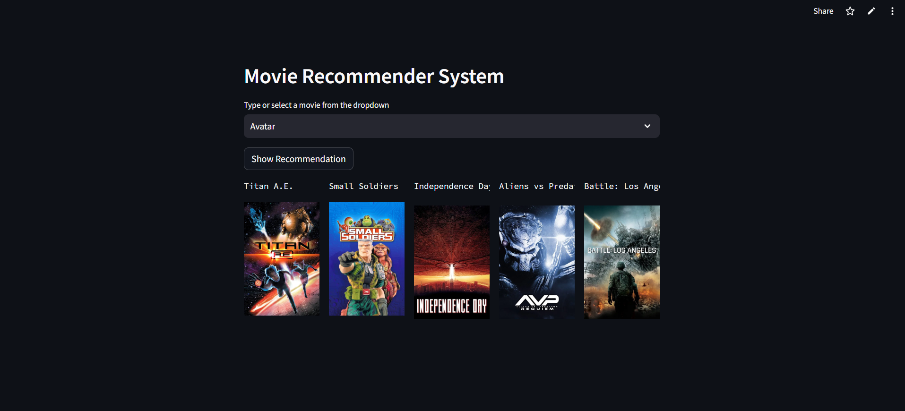

# 🎬 Movie Recommendation System with TMDB API

This is a Streamlit-based Movie Recommender System that suggests top 5 movies based on content similarity using cosine similarity and The Movie Database (TMDB) API for movie posters.

---

## 🧠 How It Works

### ✅ Recommendation Algorithm:
- **Content-Based Filtering** is used for recommendations.
- It uses **cosine similarity** on movie features (e.g., genres, overview, cast, etc. from dataset).
- When a user selects a movie, the system finds the **top 5 most similar movies** from the dataset using a precomputed similarity matrix.
- Each recommended movie's **poster** is fetched live from the TMDB API using its **movie ID**.

### ✅ Technologies Used:
- `pandas` – to manage movie data.
- `scikit-learn` – for similarity computation.
- `pickle` – to load precomputed similarity matrix and movie metadata.
- `Streamlit` – for building the web interface.
- `requests` – to fetch posters via TMDB API.

---

## 🖼 Demo Screenshot

  <!-- Replace this with actual path to your app screenshot -->

---

## 📢Demo App with Streamlit Cloud (Visualize only)

[Launch App On Streamlit](https://movie-recommended-systeem.streamlit.app/)

---

## 📦 Setup and Installation

1. Clone the repository:
```bash
git clone https://github.com/yourusername/movie-recommender-system.git
cd movie-recommender-system
```

2. Install the required libraries:
```bash
pip install -r requirements.txt
```

3. Run the Streamlit app:
```bash
streamlit run app.py
```

> Make sure you have `movie_list.pkl` and `similarity.pkl` files in your root directory.

---

## 🎯 How to Use

1. Select a movie from the dropdown.
2. Click **"Show Recommendation"**.
3. The app will display 5 similar movies along with their posters.

---

## 🔐 TMDB API Key

Ensure you have an active TMDB API key. You can sign up and generate a free one at [TMDB Developers](https://www.themoviedb.org/documentation/api).

---

## 📂 Project Structure

```
├── app.py (or chatapp.py)
├── movie_list.pkl
├── similarity.pkl
├── requirements.txt
├── img/
│   └── image.png
└── README.md
```

---

## 🤖 Author

Built with ❤️ by [Prafulla Bharate]
